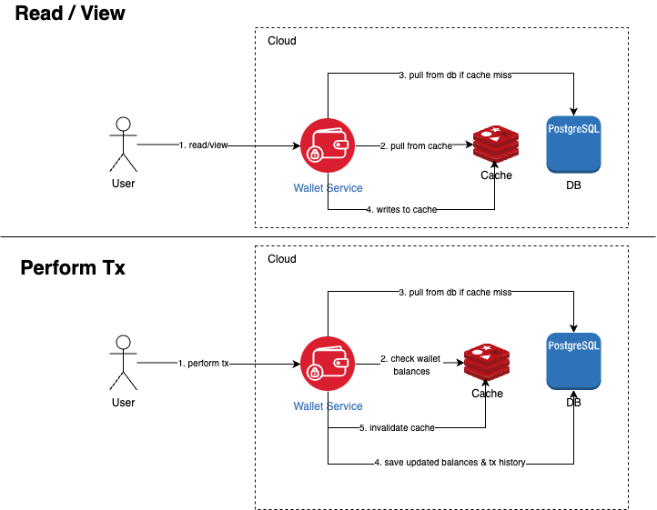
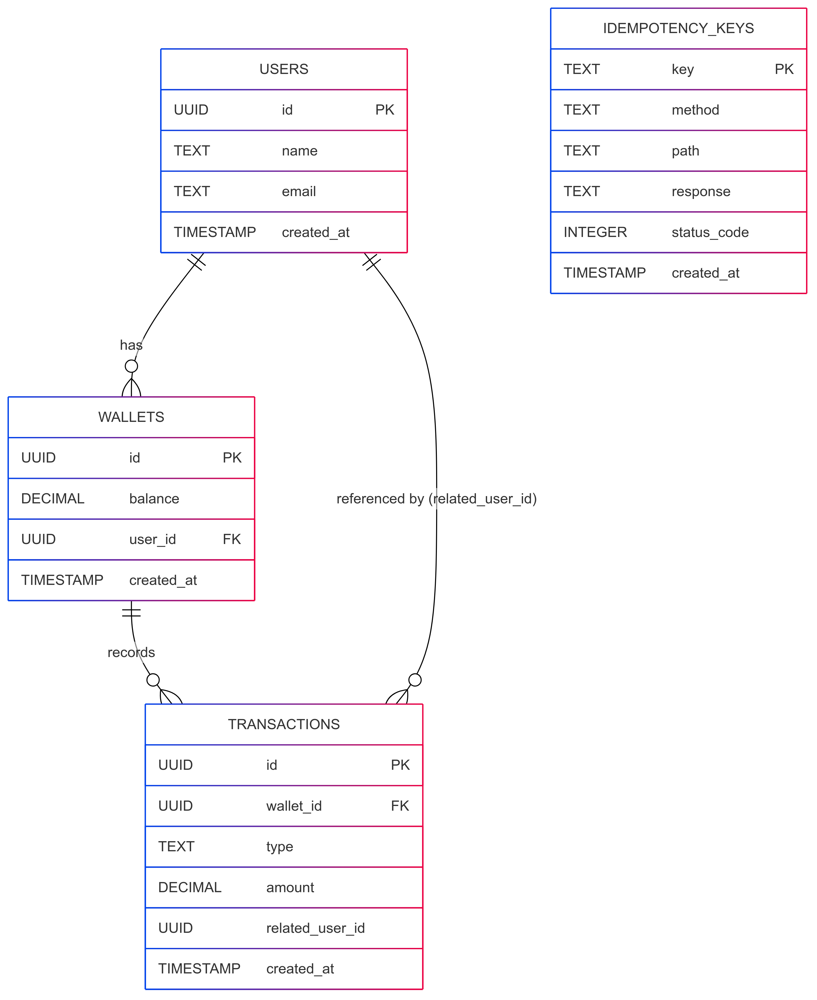

# Wallet App
A simple http wallet service written in Go.

## Setup

1. Run below commands to install dependencies
```
go mod tidy
```
2. Setup your DB and Redis config in .env
```
DB_HOST=<db_host>
DB_PORT=5432
DB_USER=<db_user>
DB_PASSWORD=<db_pass>
DB_NAME=<db_name>
REDIS_HOST=<redis_host>
REDIS_PORT=6379
```
3. Run the server with DB and Redis
```
make start
```

## Features

- Deposit
- Withdraw
- Transfer
- Balance Check
- Transaction History

## Architecture 
Below is a simplified architecture diagram for wallet service.
<br></br>


## Service Directory
```
walletapp/
├── cmd/                   # Application entry point
├── internal/              # Main application code
│   ├── api/               # Router
│   ├── common/            # Shared utilities and helpers
│   ├── config/            # Configuration loading (env, DB, Redis)
│   ├── dao/               # Database and Redis access layer
│   ├── dto/               # Request/response schema definitions
│   ├── logic/             # Business logic
│   ├── service/           # HTTP handlers and service orchestration
├── migrations/            # SQL schema and seed data
├── static/                # Static files (optional, e.g. docs/assets)

Test files are placed together directly with the code in the same folder.
...
```

## Data Schema


## API Contract
---

#### 1. Deposit

| Method | Endpoint                 | Headers                   | Request Body            | Success (200)                                                | Errors                                                                 |
|--------|--------------------------|---------------------------|-------------------------|---------------------------------------------------------------|------------------------------------------------------------------------|
| POST   | `/wallets/{id}/deposit`  | `Idempotency-Key: string` | `{ "amount": float }`   | `{ "status": "success", "data": { "message": "deposit success" } }` | 400: Missing/Invalid body or idempotency key<br>404: Wallet not found<br>500: Internal error |

---

#### 2. Withdraw

| Method | Endpoint                  | Headers                   | Request Body            | Success (200)                                                 | Errors                                                                 |
|--------|---------------------------|---------------------------|-------------------------|----------------------------------------------------------------|------------------------------------------------------------------------|
| POST   | `/wallets/{id}/withdraw`  | `Idempotency-Key: string` | `{ "amount": float }`   | `{ "status": "success", "data": { "message": "withdraw success" } }` | 400: Invalid amount or insufficient balance<br>404: Wallet not found<br>500: Internal error |

---

#### 3. Transfer

| Method | Endpoint             | Headers                   | Request Body                                                                                      | Success (200)                                                                                  | Errors                                                                                       |
|--------|----------------------|---------------------------|---------------------------------------------------------------------------------------------------|-----------------------------------------------------------------------------------------------|----------------------------------------------------------------------------------------------|
| POST   | `/wallets/transfer`  | `Idempotency-Key: string` | `{ "from_wallet_id": string, "to_wallet_id": string, "amount": float }`                          | `{ "status": "success", "data": { "message": "transfer success", "wallet_id": "...", "balance": float } }` | 400: Invalid UUID or amount<br>404: Sender/Receiver wallet not found<br>500: Transfer failure |

---

#### 4. Get Balance

| Method | Endpoint                | Headers | Request Body | Success (200)                                                  | Errors                             |
|--------|-------------------------|---------|--------------|------------------------------------------------------------------|------------------------------------|
| GET    | `/wallets/{id}/balance` | –       | –            | `{ "status": "success", "data": { "wallet_id": string, "balance": float } }` | 400: Invalid UUID<br>404: Wallet not found<br>500: Database error |

---

#### 5. Transaction History

| Method | Endpoint                         | Query Params                                                 | Success (200)                                         | Errors                      |
|--------|----------------------------------|--------------------------------------------------------------|--------------------------------------------------------|-----------------------------|
| GET    | `/wallets/{id}/transactions`     | `type`, `start`, `end`, `limit`, `offset` *(optional)*       | `{ "status": "success", "data": [Transaction] }`       | 400: Invalid wallet ID<br>500: Internal error |

---

#### Common Error Response Format

```json
{
  "error": {
    "code": <int>,
    "message": "<description>"
  }
}
```
#### Common 200 Response Format
```json
{
    "status": "success",
    "data": {
        "message": "deposit success"
        ...
    }
}
```

## Quick Demo 
You may view the demo [here](https://drive.google.com/file/d/1spFN9AWM4AEYlmGOMS_d7stcpwWB3DuM/view?usp=sharing).

## Postman Collection
You may find the collection [here](https://drive.google.com/file/d/1MG27ojR61ljJJorTkKiOBr-UYchWlCuM/view?usp=sharing).


## Done Checklist
#### Mandatory
1. Uses Go
2. Uses PostgreSQL
3. Uses Redis
4. Support mentioned features in RESTful design

#### Additional technical details
1. Adds idempotency keys to any tx 
2. Adds linter, setup in pre-commit hook
3. Adds logs
4. Adds error handling
5. Adds structured responses
4. Adds Makefile for easy commands
5. Adds unit tests, setup in pre-commit hook and done manual testing
6. Adds panic recover on router level
7. Follows good standard engineering practice

## Q&A
<b> Q: Explain any decisions you made  </b><br>
<b> A: </b>
Before the project, I have done a simplified system design which only covered architecture, api contract and data schema. QPS, data usage, monitoring and more were dropped for the simplicity of this project. 

I intentionally balanced the complexity of this project by focusing on what was necessary, avoiding overengineering while ensuring the core features were well-implemented. I've added idempotency handling, linter, pre-commit hooks, structure in responses, makefile and more. But I also avoid using goroutine, channels (takes long time to debug) and other setup like CI/CD etc. For the purpose of this project, I have enabled full logs for debugging purposes.

The project is certainly not perfect, I may have overlook certain things. I aimed to strike a balance between time spent and the overall quality of the project — including its architecture, design, and code — to ensure it was both well-structured and deliverable within a reasonable timeframe.

<b> Q: How to setup and run your code</b> <br>
<b> A: </b> [Mentioned in Setup](#setup)

<b> Q: Highlight how should reviewer view your code</b><br> 
<b> A: </b>  After reading Readme to get the full info. Feel free to view it top-down from walletapp folder. The [service directory](#service-directory) is included above. 

<b> Q: Areas to be improved</b><br> 
<b> A: </b> If time permits, including more idiomatic ways of handling. Setting up more tests like automated tests, load tests and some benchmarking tests. Setting CI/CD.

<b> Q: How long you spent on the test</b><br>
<b> A: </b>  ~12 hours.

<b> Q: Which features you chose not to do in the submission</b><br>
<b> A: </b>  I have included all features requested.

<b> Q: How does it satisfy functional and non-functional</b>  requirements<br>
<b> A: </b>  I have included a list [above](#done-checklist).

<b> Q: Does it follow engineering best practices?</b><br> 
<b> A: </b> Yes.

## Thoughts
Thanks for the opportunity to work on the project. It has been fun exploring the available libraries and be able to take full charge and write the codes from sratch again. 

## License
This project is licensed under the [MIT License](LICENSE).

